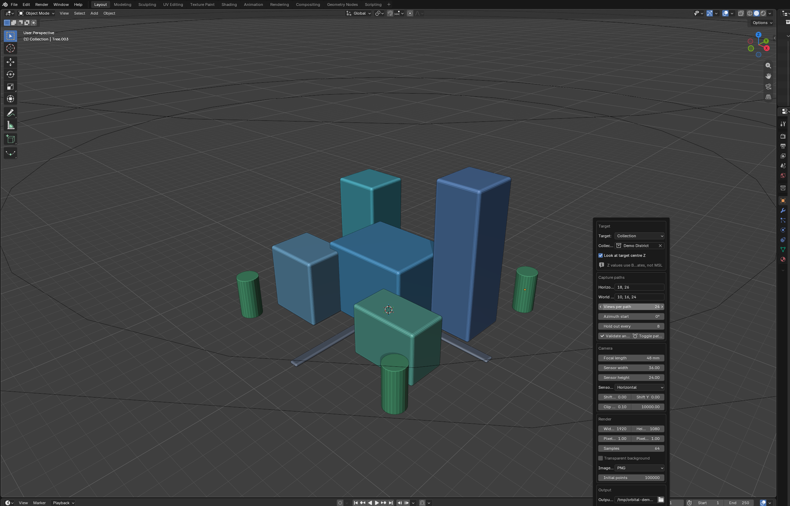
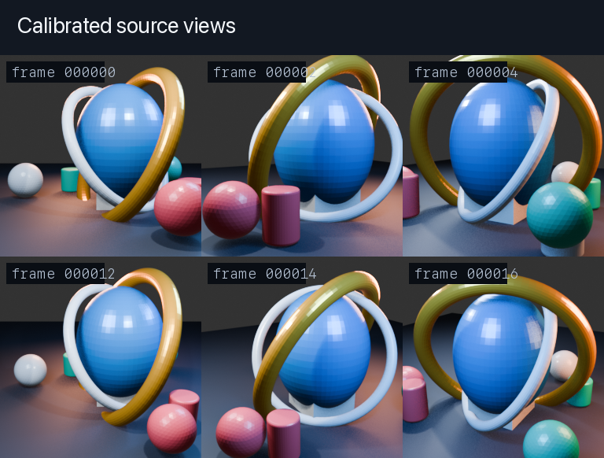
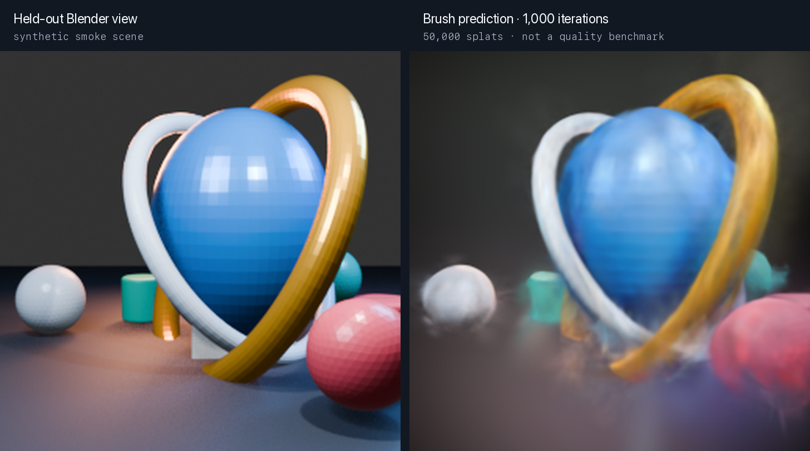
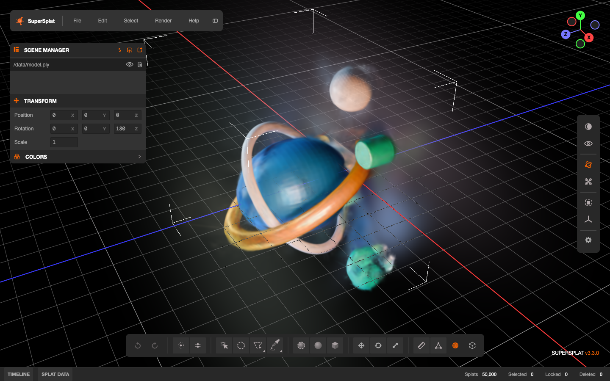

# Orbital Render for 3DGS

Orbital Render is a Blender 5 add-on that turns a scene into a calibrated COLMAP dataset for 3D Gaussian Splatting. It renders a temporary camera along horizontal paths, records the calibration and pose used for each frame, and can resume a long capture without mixing incompatible images.



## What it does

A folder of renders is not enough to train a 3DGS model. The trainer also needs the camera intrinsics, camera poses, an initial point cloud, and a stable train/evaluation split. Orbital Render writes all of them from the same frozen capture plan.

- Target selected objects, a collection, or a manual world-space region.
- Set horizontal radii and absolute Blender Z heights independently.
- Preview the paths and frame count before rendering.
- Export a standard COLMAP text model for [Brush](https://github.com/ArthurBrussee/brush).
- Export an Inria-style `cameras.json` sidecar for tools such as [SuperSplat](https://github.com/playcanvas/supersplat).
- Stop after the current frame and continue later from verified files.



## Install

Download `orbital_render_3dgs_addon.zip` from the [latest release](https://github.com/Narqulie/OrbitalRenderBlender/releases/latest/download/orbital_render_3dgs_addon.zip).

In Blender, open **Edit > Preferences > Add-ons > Install from Disk**, choose the zip, then enable **Orbital Render for 3DGS**. The add-on requires Blender 5.0 or newer. Development and release checks use Blender 5.2.2 LTS.

To build the zip yourself:

```bash
pyenv exec python scripts/build_addon.py
```

## Capture from Blender

1. Open the **3DGS Render** tab in the 3D View sidebar.
2. Choose selected objects, a collection, or a manual region.
3. Enter comma-separated radii and world Z heights. Leave either field blank to derive values from the target bounds.
4. Set the camera, render format, resolution, hold-out interval, and output directory.
5. Click **Validate and count**. Use **Toggle path preview** if you want to inspect the paths in the viewport.
6. Save the plan or start **Generate COLMAP dataset**.

Cancel waits for the current still to finish. Blender's still-render call is synchronous, so stopping halfway through an image would leave ambiguous output. If the scene changes between frames, capture stops before it can commit a mismatched frame.

## Output

```text
dataset/
  capture_plan.json
  capture_state.json
  cameras.json
  splits.json
  images/
    frame_000000.png
    ...
  sparse/0/
    cameras.txt
    images.txt
    points3D.txt
```

`capture_plan.json` is the frozen authority for target bounds, frame names, camera positions, intrinsics, camera-to-world matrices, and COLMAP poses. `capture_state.json` records the committed frame prefix, image sizes, SHA-256 checksums, and completion state.

The add-on samples evaluated target geometry for `points3D.txt`. It keeps linked collection transforms and converts curves, surfaces, metaballs, and text through Blender's evaluated mesh API. It does not invent feature tracks.

With `Hold out every` set to `8`, use the same value in Brush:

```bash
brush /absolute/path/to/dataset \
  --total-train-iters 7000 \
  --eval-split-every 8
```

Brush sorts the zero-padded image names before it selects every eighth frame, so the split matches `splits.json`.

## Headless and sliced capture

The example at [`examples/capture_config.json`](examples/capture_config.json) documents each field. Collection and manual-region targets are the most predictable choices in background mode.

Create a plan without rendering:

```bash
BLENDER=/Applications/Blender.app/Contents/MacOS/Blender

"$BLENDER" --background scene.blend \
  --python scripts/orbital_capture.py -- \
  --config examples/capture_config.json \
  --output /absolute/path/to/dataset \
  --plan-only
```

Render at most 12 new frames in one Blender process:

```bash
"$BLENDER" --background scene.blend \
  --python scripts/orbital_capture.py -- \
  --plan /absolute/path/to/dataset/capture_plan.json \
  --max-frames 12
```

Continue in a fresh process:

```bash
"$BLENDER" --background scene.blend \
  --python scripts/orbital_capture.py -- \
  --plan /absolute/path/to/dataset/capture_plan.json \
  --resume --max-frames 12
```

The first rendered slice after `--plan-only` must omit `--resume`. Later slices use it. Each successful invocation prints an `ORBITAL_CAPTURE_RESULT` JSON line. A partial slice reports `"complete": false`; the final slice reports `"complete": true`.

Resume rejects a changed plan, scene, render setting, camera record, or output artifact. It never treats an unexpected file as completed work.

## Brush and SuperSplat smoke result

The screenshots below come from a public synthetic scene, not a private or production model. The check rendered 24 views at 256 x 256, held out every sixth frame, trained Brush for 1,000 iterations, and exported 50,000 splats. The short run checks the file contract, split, export, and viewer import. It is not a reconstruction-quality benchmark.



The exported PLY and all 24 camera poses also load in SuperSplat 3.3.0. Import `cameras.json` as a file after opening the PLY.



## Calibration and scene safety

Orbital Render derives PINHOLE intrinsics from Blender's evaluated camera frame. The calculation includes effective resolution, sensor fit, camera shift, and pixel aspect. Poses use COLMAP's OpenCV world-to-camera convention.

During capture, the add-on disables border rendering, crop-to-border, and compositing so the exported full-frame calibration stays valid. It restores those settings, the active camera, render path, frame, and color state after success, cancellation, or error. The add-on owns its temporary camera and removes only that camera.

World Z means the Blender scene coordinate. It is not a verified altitude above sea level.

## Development checks

Run these commands from the repository root:

```bash
pyenv exec python -m unittest discover -s tests -p 'test_*.py' -v

/Applications/Blender.app/Contents/MacOS/Blender \
  --background --factory-startup \
  --python tests/blender_projection_test.py

/Applications/Blender.app/Contents/MacOS/Blender \
  --background --factory-startup \
  --python tests/blender_end_to_end.py

pyenv exec python scripts/build_addon.py
SMOKE_PROFILE=$(mktemp -d)
BLENDER_USER_CONFIG="$SMOKE_PROFILE/config" \
BLENDER_USER_SCRIPTS="$SMOKE_PROFILE/scripts" \
/Applications/Blender.app/Contents/MacOS/Blender \
  --background --factory-startup \
  --python tests/addon_install_smoke.py -- orbital_render_3dgs_addon.zip
rm -rf "$SMOKE_PROFILE"
```

The projection test compares independently projected Blender points with the exported PINHOLE calibration and COLMAP pose. The end-to-end test renders sliced PNG, JPEG, and OpenEXR captures, checks resume and metadata, restores scene state, and rejects source changes.
